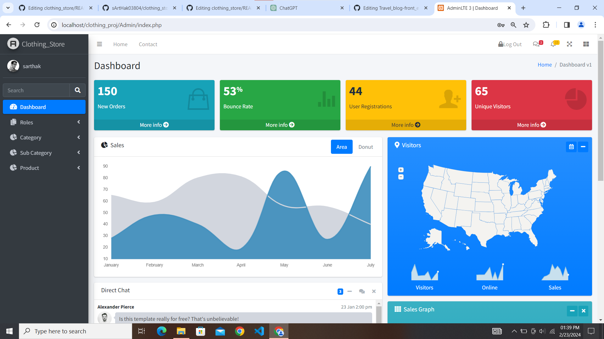

# clothing_store
 
## Table of Contents
1. [Introduction](#introduction)
2. [Project Overview](#project-overview)
3. [Technologies Used](#technologies-used)
4. [System Architecture](#system-architecture)
5. [Database Schema](#database-schema)
6. [User Interfaces](#user-interfaces)
7. [Features](#features)
8. [Installation Guide](#installation-guide)
12. [Acknowledgements](#acknowledgements)

## Introduction

Welcome to our E-Commerce Project! This project aims to provide a comprehensive online shopping experience for customers while offering powerful administrative tools for managing products, orders, and users. With a user-friendly interface and robust backend functionality, our platform caters to both customers and administrators, ensuring a seamless and efficient e-commerce operation.

Whether you're a shopper looking for the latest products or an administrator managing the backend operations, our platform strives to meet your needs with ease and efficiency. This documentation will guide you through the various aspects of our e-commerce project, including its features, architecture, installation, and usage.

We're excited to have you on board and hope you enjoy using our E-Commerce Project!

## Project Overview

Our E-Commerce Project is designed to provide a comprehensive online shopping solution for users while offering powerful management tools for administrators. The project encompasses the following key objectives and features:

- **User-Friendly Interface:** The platform offers an intuitive and visually appealing interface for customers to browse products, add items to their cart, and complete orders with ease.
  
- **Administrative Dashboard:** Administrators have access to a robust dashboard where they can manage products, orders, customers, and site configurations efficiently.
  
- **Product Management:** Administrators can add new products, update existing ones, set prices, manage inventory, and categorize products for easy navigation.
  
- **Order Management:** The system allows administrators to view and manage orders, update order status, and track shipment details.
  
- **User Authentication:** Users can create accounts, login securely, and manage their profiles, ensuring a personalized shopping experience.
  
- **Search Functionality:** Customers can search for products using keywords, categories, or filters, enhancing the browsing experience.
  
- **Checkout Process:** The platform provides a seamless checkout process with secure payment gateways, order summary, and delivery options.
  
- **Responsive Design:** The user interfaces are optimized for various devices, including desktops, tablets, and smartphones, ensuring a consistent experience across all platforms.

Our project aims to streamline the e-commerce experience for both customers and administrators, providing a reliable and efficient platform for online shopping and management.

## Technologies Used

Our E-Commerce Project utilizes a variety of technologies to deliver a robust and dynamic platform. Here are some of the key technologies and tools employed in the development process:

- **HTML5:** The foundation of our web pages, providing structure and semantics.
  
- **CSS3:** Styling the web pages to enhance visual appeal and user experience.
  
- **JavaScript (JS):** Adding interactivity and dynamic behavior to the frontend components.
  
- **jQuery:** A fast, small, and feature-rich JavaScript library simplifying tasks like DOM manipulation and AJAX requests.
  
- **AJAX (Asynchronous JavaScript and XML):** Facilitating asynchronous data exchange between the browser and server, enabling smoother and faster interactions.
  
- **PHP (Hypertext Preprocessor):** Powering the backend logic and server-side scripting for dynamic content generation.
  
- **MySQL:** Serving as the relational database management system for storing and managing data efficiently.
  
- **Custom JavaScript:** Implementing custom scripts and functionalities tailored to our project requirements.
  
- **Bootstrap:** Utilizing the Bootstrap framework for responsive design, layout components, and CSS utilities.
  
- **Git:** Version control system for tracking changes, collaborating with team members, and managing codebase.
  
- **GitHub:** Hosting platform for storing our project repository, managing issues, and facilitating collaboration.
  
- **Visual Studio Code:** Integrated development environment (IDE) used for coding, debugging, and project management.
  
- **Google Fonts:** Incorporating a wide selection of web fonts to enhance typography and readability.
  
- **FontAwesome:** Accessing a vast library of icons for enhancing visual elements and user interface components.

Feel free to explore our project repository for more details on how these technologies are utilized, and don't hesitate to reach out if you have any questions or suggestions!  

## System Architecture

Our E-Commerce Project follows a modular and scalable architecture designed to ensure reliability, flexibility, and performance. The system architecture comprises the following components:

### Client-Side Components:
1. **Frontend Interface:**
   - Utilizes HTML, CSS, JavaScript, and jQuery to create a visually appealing and interactive user interface.
   - Implements responsive design principles to ensure compatibility across various devices and screen sizes.
   - Leverages AJAX for asynchronous communication with the server, enabling seamless user interactions without page reloads.

### Server-Side Components:
1. **Backend Logic:**
   - Powered by PHP, the backend handles server-side scripting and logic execution.
   - Implements business logic for user authentication, product management, order processing, and database interactions.
   - Utilizes server-side validation to ensure data integrity and security.

2. **Database Management System (DBMS):**
   - Relies on MySQL as the relational database management system for storing and managing data.
   - Utilizes MySQL queries and transactions for efficient data retrieval, manipulation, and storage.
   - Implements database normalization techniques to minimize redundancy and ensure data consistency.

### Integration and Communication:
1. **AJAX Communication:**
   - Facilitates asynchronous data exchange between the client and server, enhancing user experience and responsiveness.
   - Utilizes AJAX requests to fetch dynamic content, submit form data, and update page elements without reloading the entire page.

2. **API Endpoints:**
   - Defines RESTful API endpoints to enable external integrations and third-party services.
   - Implements secure authentication mechanisms such as JWT (JSON Web Tokens) for API authentication and authorization.

### Deployment and Hosting:
1. **Web Server:**
   - Deploys the application on a web server environment such as Apache or Nginx  also I've tested it personaly in **xampp** .
   - Configures server settings and permissions to ensure optimal performance and security.

2. **Hosting Platform:**
   - Can be hosted  on online  plateforms like Hostinger,Godaddy,etc. 

Our system architecture is designed to accommodate future scalability and extensibility requirements, allowing seamless integration of new features and enhancements. By adopting best practices in software design and architecture, we ensure a robust and efficient e-commerce platform for our users and administrators.

## Database Schema

The database schema of our E-Commerce Project is designed to efficiently store and manage data related to products, orders, customers, and other essential entities. Below is an overview of the database schema, including tables, relationships, and attributes:

### Customer Side:

#### Tables:

1. **Products:**
   - Stores information about the products available for purchase.
   - Attributes may include product ID, name, description, price, quantity, category, image URL, etc.

2. **Orders:**
   - Contains details of customer orders placed on the platform.
   - Attributes may include order ID, customer ID, order date, total amount, payment status, etc.

3. **Customers:**
   - Holds information about registered customers.
   - Attributes may include customer ID, name, email, address, phone number, etc.

4. **Categories:**
   - Represents the categories to which products belong.
   - Attributes may include category ID, name, description, etc.

5. **Order_Items:**
   - Acts as a junction table to establish a many-to-many relationship between orders and products.
   - Attributes may include order item ID, order ID, product ID, quantity, etc.

#### Relationships:

- **One-to-Many (Products to Categories):**
   - Each product belongs to one category, but a category may have multiple products.

- **One-to-Many (Customers to Orders):**
   - Each customer can place multiple orders, but each order is associated with one customer.

- **Many-to-Many (Orders to Products):**
   - An order can contain multiple products, and a product can be part of multiple orders.

### Admin Side:

#### Tables:

1. **Admins:**
   - Stores information about administrators who have access to the admin panel.
   - Attributes may include admin ID, username, password (hashed), email, etc.

2. **Admin_Permissions:**
   - Defines permissions granted to administrators for managing various aspects of the platform.
   - Attributes may include permission ID, admin ID, permission type, etc.

#### Relationships:

- **One-to-Many (Admins to Admin_Permissions):**
   - Each admin can have multiple permissions, but each permission is associated with only one admin.

### Database Normalization:

The database schema follows normalization principles to minimize redundancy and ensure data consistency and integrity. By organizing data into separate tables and establishing relationships between them, we optimize storage efficiency and facilitate efficient querying and manipulation of data.

Our database schema is designed to support the functionality and features of our E-Commerce Project, providing a robust foundation for managing and processing data related to product inventory, customer orders, user interactions, and administrative tasks.

Our database schema is designed to support the functionality and features of our E-Commerce Project, providing a robust foundation for managing and processing data related to product inventory, customer orders, and user interactions.

## User Interfaces

Our E-Commerce Project offers intuitive and visually appealing user interfaces for both customers and administrators. Below are descriptions of each interface along with screenshots showcasing the key features:

### Customer Interface:

The customer interface provides a seamless shopping experience for users, allowing them to browse products, add items to their cart, and complete orders with ease. Key features of the customer interface include:

- **Product Catalog:** Displays a wide range of products organized into categories for easy navigation.
- **Product Details:** Provides detailed information about each product, including name, description, price, and availability.
- **Shopping Cart:** Allows users to add products to their cart, adjust quantities, and proceed to checkout.
- **Checkout Process:** Guides users through a simple and secure checkout process, including order summary, shipping address, and payment options.
- **User Account:** Enables users to create accounts, manage profiles, view order history, and track shipments.

### Admin Interface:

The admin interface offers powerful management tools for administrators to efficiently oversee and control various aspects of the platform. Key features of the admin interface include:

- **Dashboard:** Provides an overview of key metrics such as total orders, revenue, top-selling products, and customer activity.
- **Product Management:** Allows administrators to add new products, update existing ones, adjust prices, manage inventory, and categorize products.
- **Order Management:** Enables administrators to view and manage orders, update order status, process refunds, and generate reports.
- **Customer Management:** Provides access to customer profiles, allowing administrators to view order history, update information, and manage accounts.
- **Configuration Settings:** Allows administrators to configure site settings, including shipping options, tax rates, payment gateways, and email notifications.

### Screenshots:

#### Customer Interface:

#### Admin Interface:

Our user interfaces are designed with usability and functionality in mind, ensuring a seamless experience for both customers and administrators. Through intuitive design and efficient navigation, we aim to enhance user satisfaction and drive engagement on our platform.

## Features

Our E-Commerce Project offers a comprehensive set of features tailored to meet the needs of both customers and administrators. These features include:

### For Customers:
1. **User-Friendly Interface:** Intuitive and visually appealing interface for easy navigation and seamless shopping experience.
2. **Product Catalog:** Extensive range of products categorized for convenient browsing.
3. **Product Details:** Detailed information including name, description, price, and availability for informed purchasing decisions.
4. **Shopping Cart:** Flexible cart management allowing users to add, remove, and update items.
5. **Secure Checkout:** Simple and secure checkout process with multiple payment options.
6. **User Accounts:** Personalized accounts enabling users to track orders, view order history, and manage profile information.
7. **Search Functionality:** Robust search feature allowing users to quickly find desired products.
8. **Responsive Design:** Mobile-friendly design ensuring a seamless shopping experience across devices.

### For Administrators:
1. **Dashboard:** Comprehensive dashboard providing insights into sales, orders, and customer activity.
2. **Product Management:** Full control over product listings, including adding new products, updating details, and managing inventory.
3. **Order Management:** Efficient order processing with features for order tracking, status updates, and refunds.
4. **Customer Management:** Access to customer profiles for order history, account management, and support.
5. **Configuration Settings:** Customizable settings for shipping options, tax rates, and payment gateways.
6. **Reporting:** Detailed reports and analytics to monitor performance and make informed decisions.
7. **Security:** Role-based access control ensuring data security and privacy.
8. **Scalability:** Scalable architecture allowing for easy expansion and addition of new features.

## Installation Guide (Continued)

3. **Web Server Setup:**
   - Install a local server environment like XAMPP, WAMP, or MAMP on your machine.
   - Start the server and ensure that Apache and MySQL services are running.

4. **Project Configuration:**
   - Navigate to the directory where you cloned the project repository.
   - Locate the configuration files for database connection (e.g., `config.php`) in the project files.
   - Update the database connection settings (hostname, username, password, database name) according to your local environment.

5. **Start the Project:**
   - Once the server is running and the project is configured, open your web browser.
   - Enter the local server's address (e.g., `http://localhost/`) in the address bar.
   - Navigate to the directory where you placed the project files.

6. **Access the Project:**
   - You should see the project's main page or landing page.
   - From there, you can explore the customer interface by browsing products, adding items to the cart, and completing orders.
   - To access the admin interface, you may need to navigate to a specific URL or login page provided in the project documentation.

7. **Testing:**
   - Test various features of the project, including product management, order processing, user authentication, and site configuration.
   - Make sure everything is functioning as expected in your local environment.

By following these steps, you should be able to open the project in your local host environment and explore its features both from the customer and admin perspectives. If you encounter any issues during the installation process or while testing the project, refer to the project documentation or seek assistance from the project maintainers.

## Acknowledgements

We would like to express our gratitude to all contributors who have participated in the development of this project.

## License

This project is licensed under the [MIT License](LICENSE).

  
